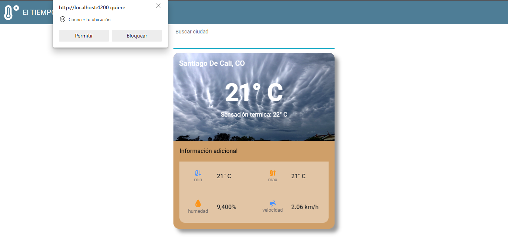

# WeatherApp

Tiene como finalidad poder consultar el clima actual de la ciudad requerida. 

## Ejecución local

Correr `ng serve`. Navegar a la ruta  `http://localhost:4200/` esto cargará la pantalla inicial.

## Integraciones y Servicios

### .Net: API de auth

Mediante un api creada en .NET, se realiza el servicio de autenticación y registro de usuario, además de guardar en base de datos el historial de consultas realizadas. 

Las 3 url disponibles de la API:
* `http://localhost:4200/api/login`
* `http://localhost:4200/api/registerclimate`
* `http://localhost:4200/api/user`

### OpenWeather: API del clima 

Se utilizó el servicio gratuito de [OpenWeather](https://openweathermap.org/current) que permite consultar el clima actual de alguna de las ciudades de los 84 paises registrados en la platafotma

Para usar el servicio es necesario contar con: 
* URL de consulta  
* Un api keY

### Geolocalización 

Se implementó un servicio  de geolocalización que le solicita al usuario acceso a este, para realizar una busqueda inicial del clima teniendo en cuenta la ciudad donde se cuentra el usuario. 

